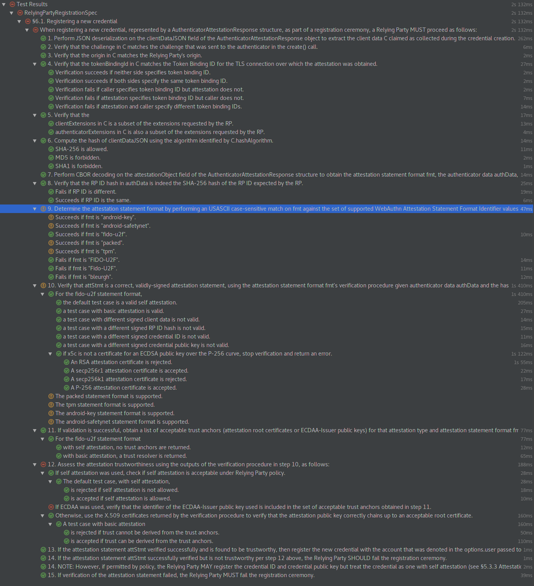
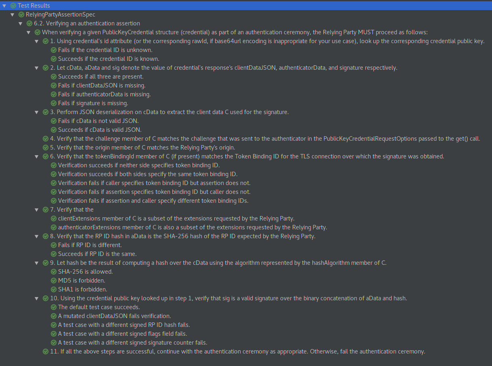

Web Authentication server library (EXPERIMENTAL)
===

This is a prototype implementation of a Web Authentication Relying Party (RP).

Running
---

An example app is included in the
[webauthn-server-demo](../webauthn-server-demo) directory. See [its
README](../webauthn-server-demo/README) for instructions on how to run it.

Implementation status
---

The following combinations of user agent and authenticator are known to work:

- Firefox Nightly 57.0a1 2017-09-15
  - YubiKey 4
  - YubiKey 4 Nano
  - YubiKey Neo - although with random failures in `credentials.get()` (login)
  - YubiKey 4C - although with random failures in `credentials.get()` (login)
  - FIDO U2F Security Key by Yubico

Test results generated from commit 8120cf1.

### Registration

### Authentication

